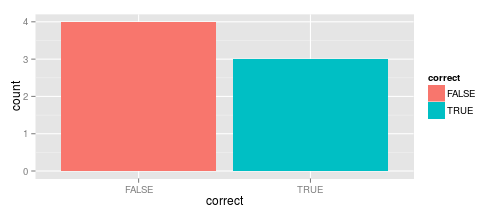

## Geo Game: Motivation

**What is the application about?**

 * Geographical game - user guesses the location of cities. 
 * Learning game : user can learn new information from the map

**Why is it important to learn interactively?**

1. Students/users can engage and have fun.
2. Learning using visual memory is more efficient - students/users remember more and learn quickly.
3. Kindles interest in the topic.

**What are the application features**

To find out, go to next slide!

--- 

## Features

**Game features:**

1. The left panel includes the map - on hover the cities are displayed (and their population)
2. There are 10 questions, each with 3 possible answers
3. After submission, there is statistics about guesses

**Example of the statistics output about guesses**

 

**The next slide is an example of the game quiz**

--- &radio
## Small Pop Quiz
To showcase the Geo Game questions:  Where is Cincinnati city ?

1. Arizona

2. _Ohio_

3. California

*** .hint
The state in which Cincinnatti city is located, boarders with Indiana
*** .explanation
Ohio

--- 
## Summary

**What have you learned thanks to the Geo Game showcase?**

* You have seen the presentation for the Geo Game
* In the future, all education should be done interatively
* You now know that Cincinnati lies in Indiana

